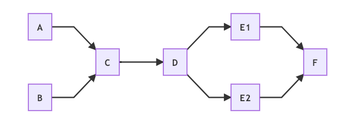

# Web Monitoring Architecture
-   [Definition of Terms](#0)
-   [System Architecture](#1)
-   [Deployment Plan](#2)
-   [Current Workflow](#3)

## Definition of Terms

* **Page**: a web resource (HTML pages, PDFs, Excel spreadsheets, CSVs, images, etc.) crawled over time by one or more services like the Internet
  Archive or Versionista.
* **Version**: a snapshot of a Page at a specific time that is different from a previous Version. 
* **Change**: two different Versions of the same Page.
* **Diff**: a representation of a Change: this could be a plain text `diff` (as in
  the UNIX command line utility) or a richer representation such as differences in the rendered HTML.
* **Annotation**: a set of key-value pairs characterizing a given Change, submitted
  by a human analyst or generated by an automated process. A given Change might
  be annotated by multiple analysts, thus creating multiple Annotations per
  Change.

## System Architecture

The project is currently divided into several repositories handling complementary aspects of web monitoring. They can be developed and upgraded semi-independently, communicating via agreed-upon interfaces. For additional information, you can contact the active maintainers listed alongside each repo:
* [**web-monitoring-db**](https://github.com/edgi-govdata-archiving/web-monitoring-db) ([@Mr0grog](https://github.com/Mr0grog))
  A Ruby on Rails app that serves database data via a REST API, serves diffs, and collects human-entered annotations.
* [**web-monitoring-ui**](https://github.com/edgi-govdata-archiving/web-monitoring-ui) ([@lightandluck](https://github.com/lightandluck))
  A React front-end that provides useful views of the diffs. It
  communicates with the Rails app via JSON.
* [**web-monitoring-processing**](https://github.com/edgi-govdata-archiving/web-monitoring-processing) ([@danielballan](https://github.com/danielballan))
  A Python backend that pulls data from a source like the Internet Archive and computes diffs.
* [**web-monitoring-versionista-scraper**](https://github.com/edgi-govdata-archiving/web-monitoring-versionista-scraper) ([@Mr0grog](https://github.com/Mr0grog))
  A set of Node.js scripts used to extract data from Versionista and load it into the database. It also generates the CSV files that analysts currently use in Google Spreadsheets to review changes. This project runs on its own, but in the future may be managed by or merged into `web-monitoring-processing`.

For more details about the models we use in Scanner see web-monitoring-db's [API documentation](https://api.monitoring.envirodatagov.org/).

## Deployment Plan

- web-monitoring-db and web-monitoring-ui are services that run on Heroku.
- web-monitoring-processing and web-monitoring-versionista-scraper are manually deployed to servers on AWS.
- We plan to re-deploy these to AWS as a Kubernetes cluster, **but that doesn’t exist yet.**

## Web Page Snapshotting/Capturing Workflow

| Diagram key | What happens | What does this | How | Criteria |
|-|-------------|-|-------|---------|
| A | [Versionista](https://versionista.com/) is scraped | [web-monitoring-versionista-scraper](https://github.com/edgi-govdata-archiving/web-monitoring-versionista-scraper) | Raw version bodies are scraped from Versionista, uploaded to S3, and the metadata (capture times, URLs, headers, etc.) are formatted and [POST](https://api.monitoring.envirodatagov.org/#/imports/post_imports_)ed to [-db](https://github.com/edgi-govdata-archiving/web-monitoring-db)  | Runs on a cron job, formats per [GH issue comment](https://github.com/qri-io/walk/issues/16#issuecomment-437785099) |
|B| [Internet Archive's Wayback Machine is queried for imports](https://archive.readme.io/docs) | [web-monitoring-processing](https://github.com/edgi-govdata-archiving/web-monitoring-processing) - this [PR](https://github.com/edgi-govdata-archiving/web-monitoring-processing/pull/174) | Data is pulled from the IA API, formatted, and [POST](https://api.monitoring.envirodatagov.org/#/imports/post_imports_)ed to [-db](https://github.com/edgi-govdata-archiving/web-monitoring-db) | Runs on a cron job, formats per [GH issue comment](https://github.com/qri-io/walk/issues/16#issuecomment-437785099) |
|C| New metadata arrives at [-db](https://github.com/edgi-govdata-archiving/web-monitoring-db) and is stored in a database | Scripts running on cron jobs that do ETL via scrapes or APIs (These scripts: [Versionista scraper](https://github.com/edgi-govdata-archiving/web-monitoring-versionista-scraper), [Wayback Machine importer](https://github.com/edgi-govdata-archiving/web-monitoring-processing))| [POST](https://api.monitoring.envirodatagov.org/#/imports/post_imports_) to [/api/v0/imports](https://api.monitoring.envirodatagov.org/#/imports/post_imports_) as JSON array or newline-delimited JSON stream (stream preferred) | Contains:<ul><li> a URL for where to retrieve the raw response body of the version</li><li> a SHA-256 hash of that data</li></ul> Example data in [GH issue comment](https://github.com/qri-io/walk/issues/16#issuecomment-437785099)|
|D| Determination is made whether or not to download the data | [-db](https://github.com/edgi-govdata-archiving/web-monitoring-db) | If the URL is in an acceptable, publicly readable location |  Acceptable location checked [per .env](https://github.com/edgi-govdata-archiving/web-monitoring-db/blob/30d976676935f5f621e18285016a137c8b55a0d8/.env.example#L26-L27) |
|    ↳ E1| URL for raw data is stored  | [-db](https://github.com/edgi-govdata-archiving/web-monitoring-db) (URI in metadata is untouched)| [-db](https://github.com/edgi-govdata-archiving/web-monitoring-db) stores URL | Happens if [-db](https://github.com/edgi-govdata-archiving/web-monitoring-db) has determined not to download the data |
|    ↳ E2| Raw data is verified and stored on URL we store and maintain | [-db](https://github.com/edgi-govdata-archiving/web-monitoring-db) (URI in metadata is changed to point to our new location) | Raw response data downloaded from the URL, verified against SHA-256 hash of the data from initial POST, and stores it (in production) in a public S3 bucket | Happens if [-db](https://github.com/edgi-govdata-archiving/web-monitoring-db) has determined to download the data |
| F | (Success state, data has been stored) | | | |

